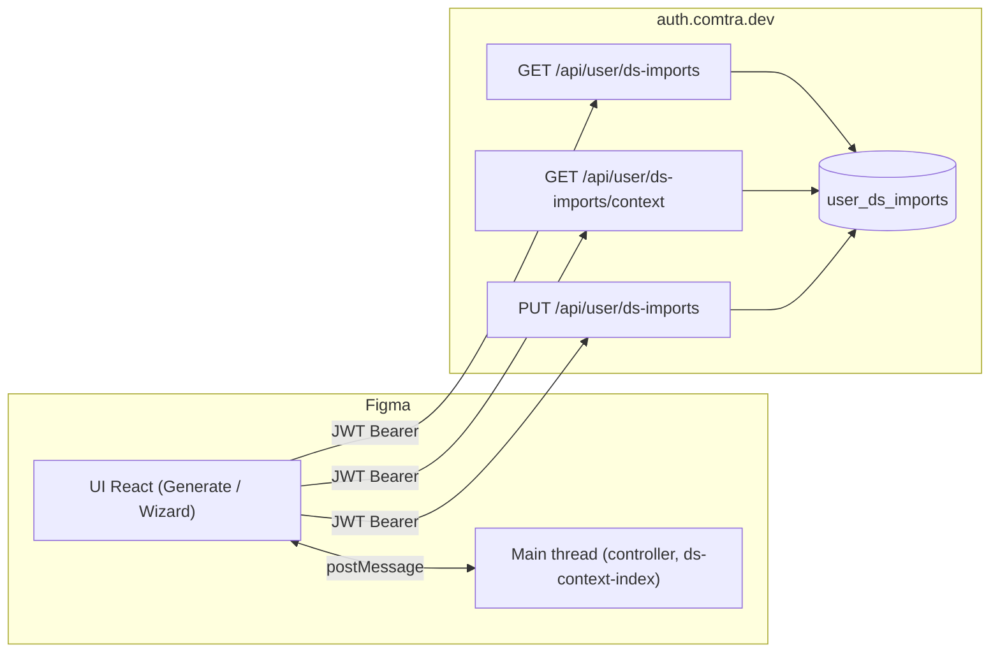

# Generate: import Design System da file Figma — contesto, architettura, incidenti e conclusioni

**Documento per review esterna (altre IA / team tecnico).**  
Versione repository: plugin Comtra (workspace `plugin-main-1`). Data di riferimento contesto conversazione: aprile 2026.

---

## 1. Executive summary

Il plugin **Comtra** offre la vista **Generate** con opzione **Design System = file corrente (Custom / Current)**. Per non bloccare Figma con una singola scansione enorme del documento, il prodotto usa un **wizard a fasi** (regole → variabili/stili → componenti) e persiste uno **snapshot strutturato** (`ds_context_index`) sul **backend** (database associato a deploy tipo Vercel + Supabase/Postgres), oltre a metadati in **localStorage** nel plugin.

Durante l’uso reale sono emersi: **lag** (step 4–5, modale post-import), **memoria** alta in Figma, percezione che il **DS “non sia riconosciuto”** nonostante dati lato server, difficoltà a **diagnosticare** senza DevTools. L’analisi ha separato nettamente:

- **Architettura prodotto** (wizard + snapshot remoto): direzione corretta per il vincolo “file grandi + main thread Figma”.
- **Implementazione** (bug di probe client, snapshot vuoto sul DB, stato React troppo grande, mancanza di feedback, race su PUT/sync): queste cause **impedivano** di raccogliere i benefici dell’architettura.

Il documento riporta il ragionamento completo, i file coinvolti, le correzioni applicate nel codice, i criteri di verifica e cosa resta eventualmente da monitorare.

---

## 2. Contesto prodotto

### 2.1 Cos’è Comtra (estremamente sintetico)

Plugin Figma “AI Design System” con tab tra cui **AUDIT**, **GENERATE**, **CODE**, **STATS**. La parte qui rilevante è **Generate** quando l’utente sceglie di ancorare >generazione> a un **design system derivato dal file Figma aperto** (non solo preset tipo Material).

### 2.2 Perché serve un “catalogo”

Per generare UI coerente con il file, il sistema deve conoscere in modo strutturato:

- regole / guidance (ove presenti),
- variabili (token) e stili,
- componenti e variant set (anche con limite/cap per performance).

Quell’aggregato è l’**indice di contesto DS** (`ds_context_index` nel payload API), costruito nel **main thread** Figma tramite messaggi UI ↔ controller (`get-ds-context-index` e varianti per fase).

### 2.3 Perché caricamento graduale + persistenza

**Problema senza fasi:** una sola richiesta “indicizza tutto” all’ingresso in Generate può:

- saturare CPU/memoria su file grandi,
- far percepire il plugin “appeso”,
- fallire per timeout unico.

**Soluzione di prodotto adottata:**

1. **Wizard** con step espliciti così il costo è **spezzato** e l’utente vede progressione.
2. **Fasi tecniche** (`rules` / `tokens` / `components`) lato controller per ridurre lavoro per singola chiamata dove possibile.
3. **Persistenza** su backend (`PUT /api/user/ds-imports`) così una **nuova sessione** plugin può recuperare lo snapshot con `GET /api/user/ds-imports/context` senza rifare subito tutta la scansione.

Questa combinazione è **standard** per plugin Figma che serializzano porzioni grandi del documento.

---

## 3. Architettura tecnica (riferimento per altre IA)

### 3.1 Flusso dati ad alto livello



### 3.2 Persistenza locale (plugin)

- **localStorage** `comtra-ds-imports-v1`: elenco import “logici” (file key, nomi, date) — `lib/dsImportsStorage.ts`.
- **sessionStorage** `comtra-ds-prepared-session`: flag “in questa sessione il catalogo per questo file è pronto” — evita di mostrare di nuovo il wizard nella stessa sessione dopo import completato.

**Regola importante aggiunta in corso d’opera:** se `GET /api/user/ds-imports` restituisce **lista vuota**, **non** sovrascrivere localStorage (evita wipe quando il server è in ritardo o errore transitorio).

### 3.3 Backend (estratto comportamento atteso)

- `GET /api/user/ds-imports`: righe per utente (senza blob indice completo nella lista).
- `GET /api/user/ds-imports/context?file_key=…`: `{ ds_context_index, ds_cache_hash }` per quel file.
- `PUT /api/user/ds-imports`: upsert con `ds_context_index` JSON (body grande).

**Nota diagnostica:** può esistere una **riga** con `figma_file_key` ma `ds_context_index` **null** o `{}` se il PUT non è mai andato a buon fine o è stato scritto male: l’UI può sembrare “importato” in senso debole ma **Generate non ha snapshot usabile**.

### 3.4 Riconoscimento “catalogo pronto” in Generate (`views/Generate.tsx`)

Ordine logico approssimativo nell’`useEffect` quando `usesFileDs === true`:

1. `requestFileContext()` → `file_key` / errori file.
2. Se `hasImportForFileKey(file_key)` → `setSessionCatalogPrepared` + `catalogReady = true`.
3. Altrimenti se `isSessionCatalogPreparedForFile(file_key)` → `catalogReady = true`.
4. Altrimenti `checkServerHasDsContext(file_key)` che internamente usa `fetchDsImportContextSnapshot` (`App.tsx`).

**Bug storico (corretto):** esisteva un `useRef` (`fileCatalogProbeRef`) che, dopo il **primo** tentativo di probe per un dato `file_key`, faceva `return` immediato sui run successivi dello **stesso** effect → nella **stessa sessione** del plugin **non si riprovava mai** il server anche dopo login, PUT riuscito, o dati ora presenti su DB. Sintomo utente: “il DS non viene riconosciuto” nonostante script/DB ok.

**Correzione:** rimosso lo short-circuit; ogni esecuzione dell’effect può rivalidare il server (accettando un costo extra di una GET context in più quando le dipendenze dell’effect cambiano — trade-off corretto per affidabilità).

### 3.5 Sniffing snapshot server (`App.tsx` → `fetchDsImportContextSnapshot`)

**Rafforzamento semantico:** `ds_context_index` è considerato **presente** solo se è un **oggetto** non-array con **almeno una chiave**.  
`null`, `{}`, `[]` → trattati come **assenza** di snapshot usabile (allineato a script `verify-ds-import.mjs` e a ciò che Generate deve considerare “ready from server”).

### 3.6 Dopo PUT (`persistDsImportToServer`)

Dopo risposta OK del PUT, viene chiamato **`syncDsImportsFromServer()`** per allineare la lista locale con `GET /api/user/ds-imports`, così `hasImportForFileKey` e la UI non restano disallineati dal server.

### 3.7 Wizard UI (`views/GenerateDsImport.tsx`)

- Step 0–1: regole/guidance.
- Step 2: fase `tokens` (variabili/stili).
- Step 3: fase `components` + merge → `wizardCapture.fullIndex` per il PUT.
- Step 4: recap.

**Ottimizzazione memoria React:** dopo merge componenti, lo stato `indexResult` **non** mantiene più l’array completo `components` in memoria: tiene `catalogPreview` (conteggi) e `components: []` per alleggerire step 4–5. Il payload completo per il server resta in `wizardCapture`.

**Feedback utente:** toast su esito PUT (successo / errore / assenza snapshot) tramite `useToast()` — evita dipendenza da Network tab (difficile su Figma desktop).

---

## 4. Sintomi utente e cause radice (mappa)

| Sintomo | Cause plausibili / verificate | Mitigazione nel repo |
|--------|-------------------------------|----------------------|
| Lag step 4–5 | Grande stato React (`components[]`), re-render wizard | Riduzione stato post-scan (`catalogPreview`) |
| “DS non riconosciuto” | Snapshot DB vuoto; oppure probe client mai ripetuto | Fix probe; validazione snapshot non vuoto; sync dopo PUT |
| Modale post-import “congelata” / UI lenta | Stesso tick: smontaggio wizard + `catalogReady` + overlay + animazioni | `startTransition` per modale/confetti; rimozione `animate-in` su overlay catalogo |
| Confetti lentissimi | **Bug RAF**: cleanup cancellava solo il primo frame, loop RAF continuava dopo unmount | `Confetti.tsx`: flag `cancelled` + cancel ultimo `rafId`; modalità `density="lite"` su Generate |
| Memoria Figma alta | Stato enorme + scansione documento | Stato alleggerito; fasi; (monitoraggio ulteriore su main thread) |
| Diagnosi difficile | Nessun feedback, CORS/cache/401 in passato | Toast PUT; `no-store` fetch; script verify; header cache su API |

---

## 5. Script di verifica (`scripts/verify-ds-import.mjs`)

**Scopo:** verificare da terminale, con lo **stesso JWT** del plugin, che:

- `GET /api/user/ds-imports` risponda e mostri `file_key` attesi;
- `GET /api/user/ds-imports/context?file_key=…` abbia uno snapshot **non vuoto** (logica allineata a `fetchDsImportContextSnapshot`).

Variabili ambiente:

- `COMTRA_JWT` (o `JWT`): Bearer token Comtra (dopo login plugin).
- `COMTRA_FILE_KEY`: file Figma (segmento URL `design/FILE_KEY/…`).
- `COMTRA_AUTH_URL` (opzionale): default `https://auth.comtra.dev`.

Comandi (dalla root del repo):

```bash
COMTRA_JWT="eyJ…" npm run verify-ds-import
COMTRA_JWT="eyJ…" COMTRA_FILE_KEY="XXXXXXXX" npm run verify-ds-import
```

**Interpretazione tipica:**  
`imports count: 1` ma `has usable ds_context_index: false` → riga presente, **blob indice mancante o vuoto** → rifare import fino a PUT ok o investigare DB.

---

## 6. Domanda architetturale: “il caricamento a step era sbagliato?”

**Risposta netta per altre IA che valutano solo l’outcome:**

- L’approccio **wizard + fasi + snapshot remoto** è **coerente** con i vincoli Figma (main thread, payload grandi, sessioni multiple) e **non** è la causa primaria dei fallimenti osservati.
- I fallimenti osservati erano in larga parte **gap di implementazione** (probe, validazione snapshot, stato UI, feedback) che **mascheravano** il valore dell’architettura.

**Metafora operativa:** avere una autostrada giusta ma una barriera chiusa al casello; non si demolisce l’autostrada, si apre la barriera.

---

## 7. Criterio di successo operativo (una definizione chiara di “funziona”)

1. Completare il wizard fino a **Confirm and import** e vedere toast **PUT OK** (e nessun toast “nessuno snapshot inviato”).
2. Chiudere e riaprire il plugin sul **medesimo file**.
3. Aprire **Generate** con “Custom (Current)”: **catalogo pronto** senza rifare il wizard (salvo invalidazione manuale “Refresh catalog”).
4. `verify-ds-import` con `COMTRA_FILE_KEY` → **snapshot usabile** (oggetto con chiavi).

Se 1–4 passano, il flusso prodotto **funziona** end-to-end. Se fallisce un solo passo, la diagnosi è **localizzabile** (PUT, GET context, probe, token).

---

## 8. File toccati (indice per code review)

| Area | File (path relativo repo) |
|------|---------------------------|
| Probe Generate / catalog ready | `views/Generate.tsx` |
| Snapshot fetch + PUT + sync | `App.tsx` |
| Wizard, toast PUT, stato leggero post-components | `views/GenerateDsImport.tsx` |
| Storage locale / merge server | `lib/dsImportsStorage.ts` |
| Confetti / performance RAF | `components/Confetti.tsx`, `views/Generate.tsx` (modal) |
| API / cache / CORS (contesto deploy) | `auth-deploy/oauth-server/app.mjs`, `auth-deploy/api/credits-trophies.mjs`, `auth-deploy/vercel.json` |
| Verifica CLI | `scripts/verify-ds-import.mjs`, `package.json` script `verify-ds-import` |
| Indice main thread (fasi) | `controller.ts`, `ds-context-index.ts` |

---

## 9. Rischi residui e lavoro futuro (onesto)

- **Costo Figma** su file enormi resta reale nelle fasi `tokens` / `components`: il wizard **non elimina** il picco, lo **sposta** e permette **reuse** via server.
- **Race** DB estremamente rare: PUT seguito immediatamente da GET potrebbe in teoria vedere replica in ritardo; in pratica su Postgres singolo di solito no.
- **401 ripetuti:** il plugin può impostare flag per non martellare le API; richiede login pulito.
- **Ulteriore profiling:** se dopo le ottimizzazioni UI il collo di bottiglia resta, strumentare tempi `get-ds-context-index` per fase sul main thread.

---

## 10. Appendice — messaggi utente vs stato sistema (glossario)

- **“Importato” in senso UI locale:** `sessionStorage` + `catalogReady` true dopo wizard.
- **“Importato” in senso server forte:** riga `user_ds_imports` con `ds_context_index` **non vuoto**.
- **“Non riconosciuto”:** spesso mismatch tra i due sensi sopra, o probe che non rivalidava, o JWT/scadenza.

---

## 11. Nota privacy / sicurezza

Il JWT Comtra è **equivalente a una sessione**. Non va incollato in chat pubbliche, log di supporto non redatti, o screenshot. È stato aggiunto (e poi rimosso) un pannello dev temporaneo per copiarlo in ambiente controllato; in produzione non deve esistere.

---

*Fine documento. Per domande mirate alle altre IA: allegare questo file + eventuale output di `verify-ds-import` (senza JWT) + status HTTP del PUT dalla UI (toast).*
